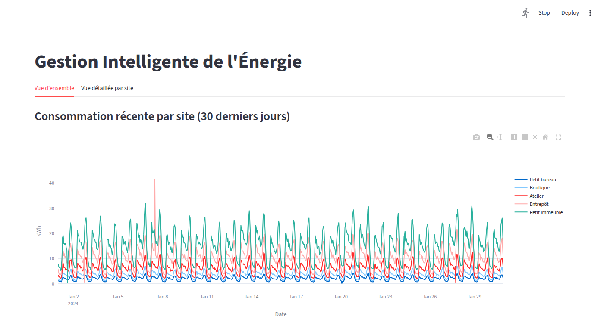
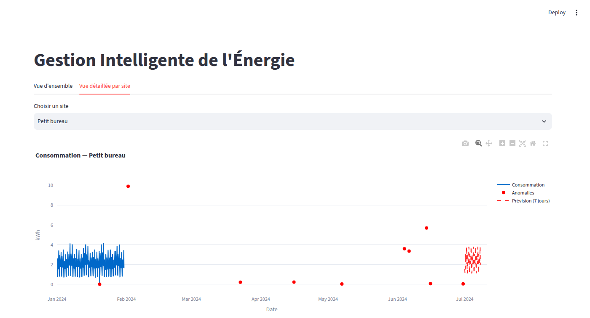

# Gestion Intelligente de l'Énergie

Suivi de consommation électrique multi-sites avec détection automatique d'anomalies et prévision à 7 jours, exposé via une API et un dashboard interactif.

## Contexte et objectif

**Cas d'usage** : un gestionnaire de bâtiment suit la consommation électrique de plusieurs sites (bureau, boutique, atelier, entrepôt, immeuble), reçoit une alerte quand un site consomme anormalement, et dispose d'une prévision à 7 jours pour anticiper les pics.

**Source de données** : le dataset réel [UCI "Individual Household Electric Power Consumption"](https://archive.ics.uci.edu/dataset/235/individual+household+electric+power+consumption) (mesures minute par minute sur ~4 ans) sert à extraire un **profil de consommation réel** (facteurs horaires et hebdomadaires). Ce profil est ensuite utilisé pour générer des **données synthétiques multi-sites** (5 sites, 6 mois, pas horaire, avec anomalies injectées et vérité terrain connue) — le choix synthétique permet un dashboard multi-sites réaliste sans dépendre d'un unique compteur réel.

Le projet couvre volontairement les 6 compétences visées : base de données SQL, API backend, analyse de données, détection d'anomalies, prévision, et dashboard.

## Aperçu visuel

**Vue d'ensemble** — consommation des 5 sites sur 30 jours :



**Vue détaillée par site** — consommation, anomalies détectées (points rouges) et prévision à 7 jours :



## Architecture

```
UCI (profil réel)  ─┐
                     ├─▶ génération synthétique multi-sites ─▶ PostgreSQL (Supabase)
Anomalies injectées ─┘                                              │
                                                                     ▼
                                          detection.py / forecast.py (batch)
                                                                     │
                                                                     ▼
                                                    API FastAPI (/sites, /mesures,
                                                       /anomalies, /previsions)
                                                                     │
                                                                     ▼
                                                    Dashboard Streamlit (Plotly)
```

Le dashboard ne parle **jamais directement à la base** : tout passe par l'API, pour garder la séparation backend/présentation démontrable.

## Stack technique

| Composant | Choix | Pourquoi |
|---|---|---|
| Base de données | PostgreSQL (Supabase) | SQL relationnel classique, contraintes d'unicité (`site_id, timestamp`) pour un ingest idempotent |
| API | FastAPI + uvicorn | Typage des paramètres de requête natif, doc `/docs` générée automatiquement |
| Détection d'anomalies | **Résidu vs profil attendu** (moyenne/écart-type glissants sur le résidu, pas sur la valeur brute) | Un seuil sur la valeur brute confond "pic anormal" et "consommation normale plus élevée l'hiver / en journée". En travaillant sur le **résidu** (valeur − consommation attendue selon l'heure et le jour de la semaine), la saisonnalité normale est retirée avant de chercher l'anomalie — un seuil fixe sur le résidu est donc comparable d'une heure à l'autre |
| Prévision | Holt-Winters (`statsmodels.tsa.holtwinters.ExponentialSmoothing`), saisonnalité horaire (24) | Série avec tendance + saisonnalité journalière claire ; Holt-Winters capture les deux avec un modèle simple et interprétable, sans sur-ingénierie (pas besoin d'un modèle ML plus lourd pour ce signal) |
| Dashboard | Streamlit + Plotly | MVP 100% Python livré rapidement, connecté à l'API en HTTP |

## Résultats mesurés

**Détection d'anomalies** (validée contre la vérité terrain injectée, `data/anomalies_verite_terrain.csv`) :

| Seuil (×écart-type du résidu) | Précision | Recall |
|---|---|---|
| 3 | 23,3 % | 100 % |
| 4 | 76,9 % | 100 % |
| **5** | **100 %** | **100 %** |

Seuil retenu : **5**. Sur l'ensemble des 5 sites, la moyenne reste haute (précision ≥ 88,9 %, recall entre 80 % et 100 % selon le site) — voir *Limites connues* pour l'explication des faux négatifs résiduels.

**Prévision** (Holt-Winters, backtesting sur 4 splits glissants de 14 jours, série nettoyée des anomalies) :

| Split | MAE (kWh) | MAPE |
|---|---|---|
| 1 | 0,335 | 20,7 % |
| 2 | 0,388 | 24,4 % |
| 3 | 0,251 | 15,0 % |
| 4 | 0,348 | 21,8 % |
| **Moyenne** | **0,33** | **20,5 %** |

## Comment lancer le projet

Prérequis : Python 3.12, un projet Supabase (ou toute instance PostgreSQL).

```bash
git clone <repo>
cd gestion_intelligente_de_l_energie
python3 -m venv venv
source venv/bin/activate
pip install -r requirements.txt
```

Créer un fichier `.env` à la racine :

```
DB_HOST=...
DB_PORT=5432
DB_NAME=...
DB_USER=...
DB_PASSWORD=...
```

> **Note** : privilégier la chaîne de connexion "Session pooler" (Project Settings →
> Connect → Session pooler) plutôt que "Direct connection" — cette dernière utilise
> IPv6 par défaut, indisponible sur certains réseaux.

Créer le schéma (dans l'éditeur SQL de Supabase, ou `psql`) — reproduction exacte de celui utilisé pour valider les résultats de ce projet :

```sql
CREATE TABLE sites (
    id SERIAL PRIMARY KEY,
    nom TEXT NOT NULL,
    echelle NUMERIC(6,2) NOT NULL
);

CREATE TABLE mesures (
    id BIGSERIAL PRIMARY KEY,
    site_id INT NOT NULL REFERENCES sites(id) ON DELETE CASCADE,
    timestamp TIMESTAMP NOT NULL,
    valeur_kwh NUMERIC(10,3) NOT NULL,
    UNIQUE (site_id, timestamp)
);
CREATE INDEX idx_mesures_site_temps ON mesures(site_id, timestamp);

CREATE TABLE anomalies (
    id SERIAL PRIMARY KEY,
    mesure_id BIGINT NOT NULL REFERENCES mesures(id) ON DELETE CASCADE,
    methode TEXT NOT NULL,
    score NUMERIC(8,4),
    detectee_le TIMESTAMP NOT NULL DEFAULT now()
);

CREATE TABLE previsions (
    id SERIAL PRIMARY KEY,
    site_id INT NOT NULL REFERENCES sites(id) ON DELETE CASCADE,
    horizon_timestamp TIMESTAMP NOT NULL,
    valeur_prevue NUMERIC(10,3) NOT NULL,
    date_calcul TIMESTAMP NOT NULL DEFAULT now()
);
```

Puis, **depuis la racine du projet** :

```bash
# 1. Générer les données synthétiques (nécessite data/conso_horaire_propre.csv,
#    produit par notebooks/01_exploration.ipynb à partir du dataset UCI)
python -m src.ingestion.generate_synthetic_data

# 2. Charger sites + mesures en base
python -m src.ingestion.load_to_db

# 3. Détecter les anomalies (écrit dans la table `anomalies`)
python -m src.detection.run_detection

# 4. Générer les prévisions à 7 jours (écrit dans la table `previsions`)
python -m src.forecast.run_forecast
```

Lancer l'API (depuis `src/api/`, requis par son import relatif de `db.py`) :

```bash
cd src/api
uvicorn main:app --reload
```

Dans un second terminal, depuis la racine, lancer le dashboard (il attend l'API sur `http://127.0.0.1:8000`) :

```bash
streamlit run src/dashboard/app.py
```

## Limites connues

- **Détection — anomalies synthétiques "faciles"** : les anomalies injectées (pics ×3-5, coupures ×0-0,1) sont des écarts francs. Une dérive lente ou une anomalie de faible amplitude serait probablement absorbée par la fenêtre glissante et non détectée.
- **Détection — indétectabilité en début de fenêtre** : la moyenne/écart-type du résidu se calcule sur une fenêtre glissante de 7 jours (`min_periods=24`). Une anomalie survenant avant que la fenêtre soit pleine (début de série, ou juste après une période sans historique) peut ne pas être détectée — c'est la cause principale des faux négatifs observés sur certains sites (recall < 100 % pour 3 des 5 sites en test global, alors que le seuil=5 donne 100 % sur le site utilisé pour le calibrage).
- **Prévision — MAPE peu fiable sur les faibles valeurs** : le MAPE (~20 % en moyenne) est mécaniquement gonflé aux heures de très faible consommation (nuit), où une petite erreur absolue devient un grand pourcentage. Le MAE (~0,33 kWh) est la métrique la plus stable ici.

## Pistes d'amélioration

- Dashboard React + Recharts consommant l'API, pour une démonstration full-stack plus poussée que Streamlit.
- Alertes email (SMTP) ou webhook Slack/Discord sur anomalie sévère — Phase 8 repoussée, à faire une fois le socle détection/prévision stabilisé.
- Endpoint `POST /detecter-anomalies` pour déclencher la détection à la demande plutôt qu'en script batch.
- Isolation Forest en complément de la méthode par résidu, pour comparer une approche non supervisée sur les mêmes données.
- Déploiement démo public (API sur Render/Railway, dashboard sur Streamlit Cloud).

## Démo en ligne

- **Dashboard** : https://gestion-intelligente-energie.streamlit.app/
- **API** : https://gestion-intelligente-de-l-energie-api.onrender.com/docs

> Note : l'API est hébergée sur le plan gratuit de Render, qui se met en veille après 
> 15 minutes d'inactivité — le premier chargement du dashboard après une pause peut 
> prendre 30 à 50 secondes.
